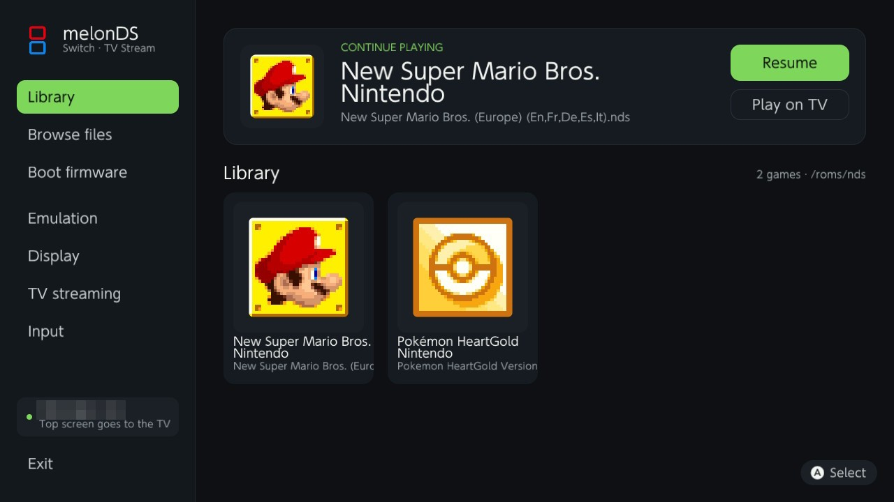
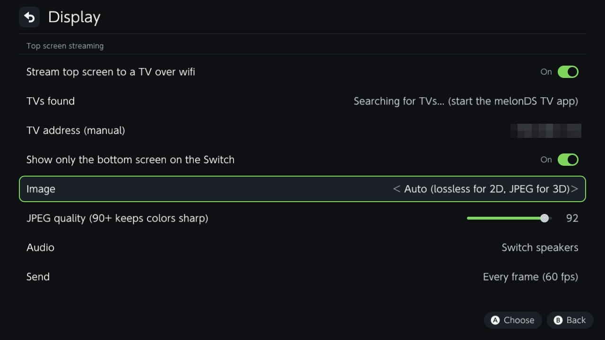

# melonDS Switch TV Stream

**Play Nintendo DS games on a modded Nintendo Switch with the top screen on your Android TV,
over wifi, and the touch screen on the Switch. No dock, no HDMI cable.**

Two parts work together:

- **melonDS Switch (patched)** — the emulator, running on the Switch in handheld mode. It
  captures the emulated top screen every frame, compresses it and sends it over wifi
  together with the game audio. The Switch itself shows only the bottom (touch) screen.
- **melonDS TV** — an **Android TV** app (Google TV, Nvidia Shield, Chromecast with Google TV,
  most smart TVs running Android TV 8 or later) that receives the stream and shows it full
  screen with pixel-perfect scaling and low latency. It also plays the audio if you want.

Both devices only need to be on the same wifi network. The Switch finds the TV by itself.

> Unofficial project, not affiliated with Nintendo, Google or the melonDS team.





## Status

| Part            | State                                                                   |
|-----------------|-------------------------------------------------------------------------|
| Switch homebrew | Tested on a real Switch: full speed with the TV stream on            |
| Android TV app  | Tested on an Android 14 TV                                              |

## Features

- A redesigned interface on the Switch: game library with icons, "continue playing" card,
  touch-friendly menus, dark theme.
- Top screen on the TV, bottom screen full size on the Switch, touch works as usual.
- Lossless picture for 2D games, high-quality JPEG for 3D scenes (automatic), or pick one.
- Game audio on the TV or on the Switch, your choice.
- The Switch lists the TVs found on the network; no address to type (manual entry possible).
- TV app: fill-screen sharp scaling, pixel perfect or smooth; adjustable audio latency;
  statistics overlay; remembers its settings.
- Everything stays on your local network. Nothing is collected or sent anywhere else.

## Requirements

- A Nintendo Switch running custom firmware (Atmosphère) able to run homebrew.
- Your own DS BIOS and firmware dumps (`bios7.bin`, `bios9.bin`, `firmware.bin`), dumped
  from a DS you own, and your own game dumps. **None of these are included and none will
  ever be.**
- An Android TV device on the same wifi network.

## Install

### On the Switch

1. Download `melonDS-switch-<version>.nro` from the Releases page.
2. Copy it to `sdmc:/switch/melonds/melonDS.nro` next to `bios7.bin`, `bios9.bin` and
   `firmware.bin`.
3. Start melonDS, open **Settings > Display > Top screen streaming**, enable streaming and
   pick your TV in **TVs found** (start the TV app first). Choose **Audio: TV** if you want
   the sound on the TV.
4. Keep the JIT recompiler enabled and the CPU clock at 1785 MHz (**Settings > Emulation**,
   the defaults of this build). Without them 3D games are far too slow, whether you stream
   or not.

### On the Android TV

1. Download `melonDS-tv-<version>.apk` from the Releases page.
2. Install it with adb (`adb install melonDS-tv-<version>.apk`) or from a USB stick with any
   file manager that can install APKs (enable "unknown sources" for it).
3. Launch **melonDS TV**. It shows its name and address and waits for the Switch.
   **OK** or **Menu** opens the settings, **Back** closes them.

## Settings reference (Switch side, `melonDS.ini`)

| Key               | Default | Meaning                                                    |
|-------------------|---------|------------------------------------------------------------|
| `StreamEnable`    | 0       | Stream the top screen                                      |
| `StreamHost`      |         | TV address (set from the "TVs found" list or typed)        |
| `StreamPort`      | 9797    | UDP port of the TV app                                     |
| `StreamCodec`     | 2       | 0 JPEG, 1 lossless (QOI), 2 auto (lossless if small)       |
| `StreamQuality`   | 92      | JPEG quality (90+ keeps colors sharp)                      |
| `StreamFrameSkip` | 1       | 1 = 60 fps, 2 = 30 fps, 3 = 20 fps                         |
| `StreamAudio`     | 0       | 0 Switch speakers, 1 TV                                    |
| `StreamHideTop`   | 1       | Show only the bottom screen on the Switch while streaming  |

## How it works

The deko3d renderer of melonDS Switch composes the top screen on the GPU. After each frame it
is copied back to CPU memory, handed to a worker thread on a spare core, encoded (QOI or JPEG)
and sent as UDP datagrams. Audio samples are sent as raw PCM from the audio thread.

### Wire format

Video: one datagram = 20-byte little-endian header + up to 1400 bytes of the image file.

| Field      | Type | Meaning                                                         |
|------------|------|-----------------------------------------------------------------|
| magic      | u32  | `0x3153444D` (`"MDS1"`, JPEG) or `0x3253444D` (`"MDS2"`, QOI)   |
| frameId    | u32  | increases with every frame                                      |
| totalSize  | u32  | size of the whole image file                                    |
| partOffset | u32  | byte offset of this payload in the file                         |
| partIndex  | u16  | part number                                                     |
| partCount  | u16  | number of parts of this frame                                   |

The image is 256x192. Receivers show the newest complete frame and drop incomplete ones.

Audio: `u32 0x4153444D ("MDSA"), u32 sequence, u32 sampleRate, u16 channels, u16 frames`,
then interleaved s16 PCM.

Discovery (UDP 9798): the Switch broadcasts `u32 0x5153444D ("MDSQ"), u32 version`;
receivers answer `u32 0x5253444D ("MDSR"), u16 streamPort, u16 nameLength, UTF-8 name`.

## Building

### Switch homebrew

Requires [devkitPro](https://devkitpro.org/wiki/Getting_Started) with the `switch-dev` and
`switch-curl` packages, plus CMake and Ninja.

```bash
export DEVKITPRO=/opt/devkitpro PATH=/opt/devkitpro/tools/bin:/opt/devkitpro/devkitA64/bin:$PATH
cd switch && mkdir -p build && cd build
cmake .. -G Ninja -DENABLE_OGLRENDERER=OFF -DBUILD_QT_SDL=OFF \
  -DCMAKE_TOOLCHAIN_FILE=../cmake/Toolchain-cross-Switch.cmake -DCMAKE_BUILD_TYPE=Release
ninja
```

### Android TV app

Requires the Android SDK (platform 37, build-tools 36) and a JDK 17 or later.

```bash
cd android-tv
echo "sdk.dir=$HOME/Library/Android/sdk" > local.properties
./gradlew assembleDebug
```

### Desktop test receiver

`tools/stream_receiver.py` shows the stream in a window on a computer (Python 3, Pillow, Tk)
and answers discovery like the TV app does. Handy for development.

Continuous integration builds both binaries on every push and attaches them to GitHub
releases on `v*` tags (see `.github/workflows/build.yml`).

## Repository layout

| Folder        | Content                                                                 |
|---------------|-------------------------------------------------------------------------|
| `switch/`     | melonDS Switch, based on [Gheovgos/melonDS](https://github.com/Gheovgos/melonDS) `switch-new`, with the streaming patches (upstream history kept) |
| `android-tv/` | melonDS TV, the Android TV app (Kotlin, no external dependencies)       |
| `tools/`      | Desktop test receiver                                                   |

## Credits

melonDS is the work of Arisotura and the melonDS team. The Switch port was created by
Hydr8gon and carried on by RSDuck, Jpe230 and Gheovgos. This project adds the TV streaming
on top of their work. See [THIRD_PARTY.md](THIRD_PARTY.md) for the full list.

## License

GPL-3.0-or-later, like melonDS. See [LICENSE](LICENSE).
